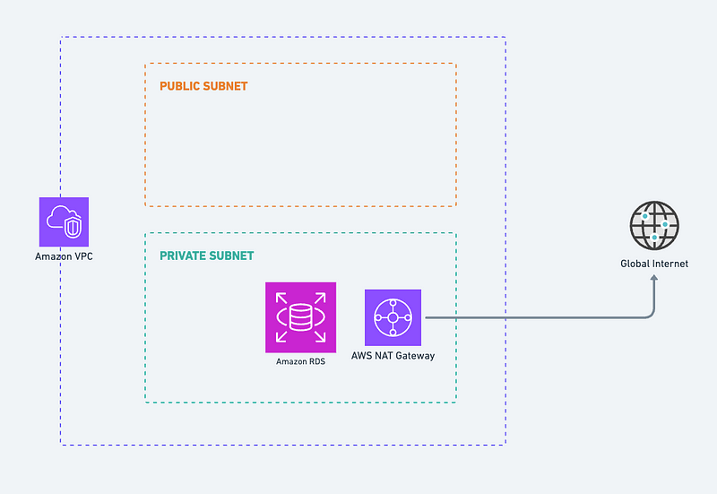

# restful-app Infrastructure

## Overview Architecture


## Explain in details

The above image is an overview of the infrastructure. I'll split into three main parts:

- Networking
- RDB
- Server App

### Networking


This is the place for configuring:

- VPC.
- Public / Private subnets.
- Internet / NAT gateway.

### RDB



This is for the database, I'll use the `aurora-postgresql` of AWS for the database on the cloud environment.

### Server App


This part includes:

- Load balancer
- EKS
- ECR

## How to execute

Before continuing make sure that your PC has installed the terraform CLI.

The project has two main folders:

- modules: the base config of the resources.
- environments: for customizing resources base on the environments (staging, production).

For example for staging environment.

1. Go to inside the staging folder

```sh
cd ./environments/staging/
```

2. Init the app:

```sh
terraform init
```

3. Plan the changes:

```sh
terraform plan
```

4. Apply the changes:

```sh
terraform apply
```
